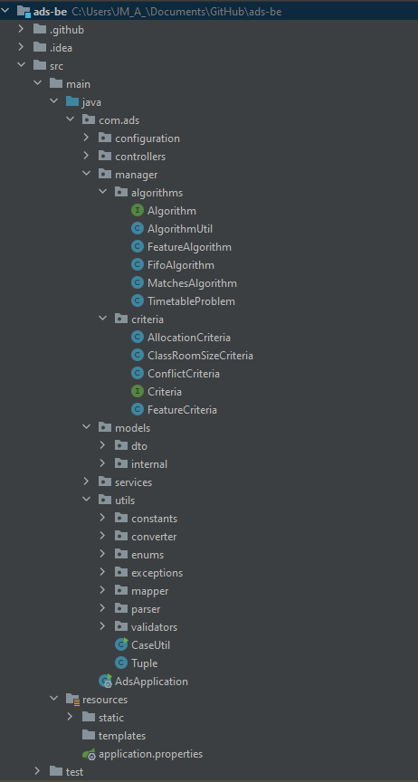
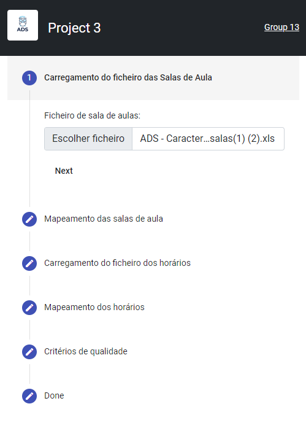

# ADS

# Project 3: Dynamic selection and invocation of scheduling/timetabling algorithms

- Flexible import Reading (from user and from schedule/timetable initial CSV, XML, Json, BD, Web Services data) and
  computing scheduling/timetabling problem properties
- Schedules/timetables problem representation
- Query the knowledge base for the selection of a set of the most suitable scheduling/timetabling algorithms which are
  able to solve a problem with those properties
- Information extraction and visualization of scheduling/timetabling algorithms (matching the set of the most suitable
  scheduling/timetabling algorithms) from a selected (Java/Python) library/API containing a large variety of algorithms
- Taking into account the information extracted from the (Java/Python) library/API, perform the dynamic invocation of
  the most suited algorithm present in the library, according to its availability in the library/API and its order in
  the most suited algorithms selection list
- Compute generated schedules/timetables quality metrics
- Export the generated (best) schedules/timetables (CSV, XML, Json, DB, Web Service)

# Problem Case
- List of integers-> index: timetables, value on index: classroom
- Constraint: penalization of classroom in multiple timetables at the same schedule
- Objectives: Different strategies to bring successful results of results(it's mandatory at least one)
- Object representation: [Timetable Problem](adsbe/src/main/java/com/ads/manager/algorithms/TimetableProblem.java)

# BackEnd Project structure


# Procedures
  - Import the file "ADS - Caracterizacao das salas.xls";
  - Consult the knowledge base and search for the most suitable algorithm (API SWRL) capable of solving the problem of room allocation;
  - Perform dynamic invocation of the most suitable algorithm, taking into account the extraction of the knowledge base;
  - Define quality metrics for allocations;
  - Compare the metrics with the result of allocations;
  - View more than one allocation suggestion, if the user wishes.

# Quality criteria:
  - Tolerance in the number of students allocated in the classrooms;
  - The smallest number of classes without allocated rooms;
  - The smallest number of room changes in sets of classes;
  - The least number of building changes in sets of classes;
  - Greater number of auditoriums, with several hours in a row, without class allocation;
  - Greater correspondence of the characteristics of the classrooms with the class.

The user will be able to choose the schedule he prefers according to the weight he attributes to each quality criterion.

# Docker
  - [Docker overview](docker/README.md)

### Installing Prerequisites
* [Docker - installation](https://docs.docker.com/engine/install/ubuntu/)
* [Docker Compose - installation](https://docs.docker.com/compose/install/)

#### How to run
1) On project root execute the following [script](docker/build-image.sh) ```docker/./build-image.sh 1.0.0``` to build images from FrontEnd and BackEnd. You also have individual scripts each server.
2) Normal run: ```docker-compose -f docker/docker-compose.yml up``` Detached
   run: ```docker-compose -f docker/docker-compose.yml up -d```
3) Go to the home page or execute the following command: ```curl http://<domain>/```
4) Swagger is available ```curl http://<domain>/swagger-ui/```

Note: You also can run without dockerfile

# Project Overview

[Demo](https://ads-group13-project3.azurewebsites.net/)



# Programming language used: 
- JAVA
- TypeScript

# Application framework used

* [Angular](https://angular.io/)
* [Spring Boot](https://spring.io/projects/spring-boot)

# Backend support library: 
- POI
- Apache Commons
- Swagger
- Opencsv
- SWRLAPI
- JMetal

# UI Interface: 
- HTML
- CSS
- TypeScript

# Deploy
- Google Cloud Plataform
- Azure Devops

# Documentation
## JavaDoc
[Documentation](javadoc/index.html)

# Contributors 
* [João Marques](https://github.com/jmamarques)
* [Carolina Camilo](https://github.com/CarolinaCamilo)
* [Bruna Amorims](https://github.com/brunaamorims)
* [Ricardo](https://github.com/Ricrolim)
